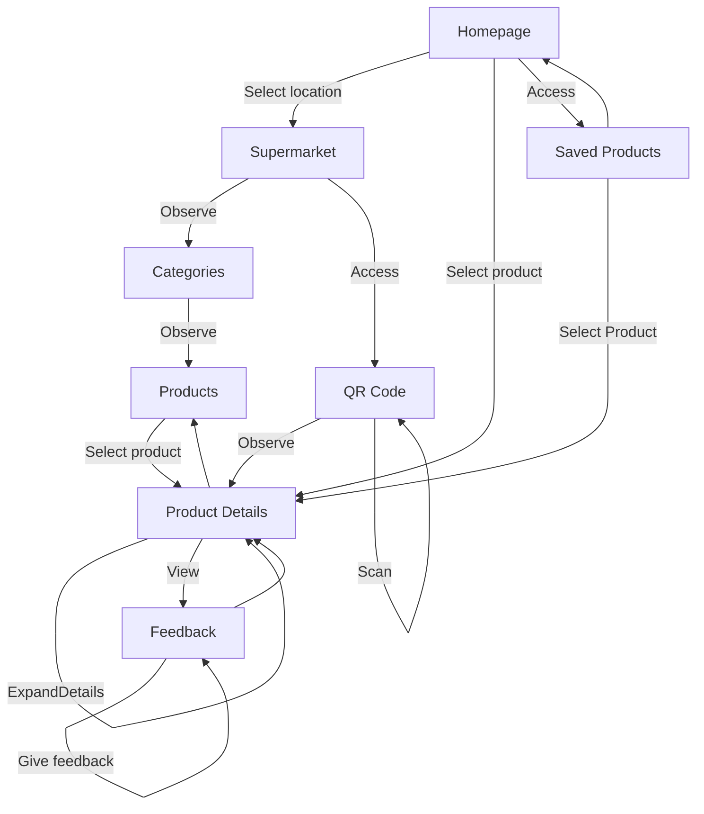
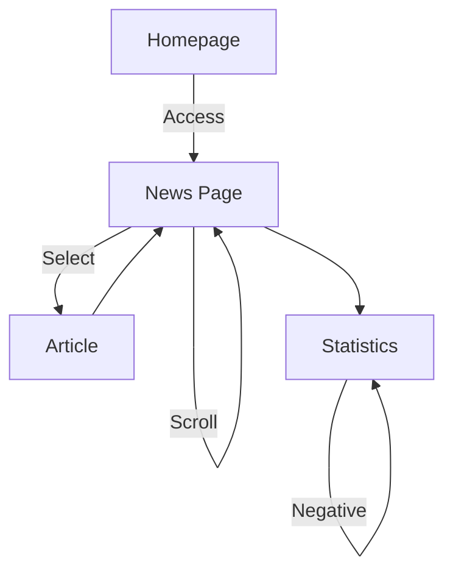

# `Story-Space` and `FE Orchestration` for QRMeat
QRMeat is an app with the goal of informing users about the **details of the meat products** they consume, such as their origin and history. Thus, the primary aim of the app is reflected in its functionality, as the majority of interactions guide users towards the Products details page, as seen below.

## Story 1

### FE Orchestration

| Workflow  | Steps                                                                                 |
|:-----------:|:-------------------------------------------------------------------------------------:|
|     1       | Select location → Observe Categories → Observe Products → Select product → View Product Details  → View Feedback → Save product → Give Feedback      |
|     2       | Select location → Access QR Code → Scan Product → Observe Product Details → View Feedback → Save product → Give Feedback |
|     3       | Select product → View Feedback → Save product → Give Feedback |
|     4       | Access Saved Products → Select product → View Feedback → Save product → Give Feedback |

## Story 2

### FE Orchestration

| Workflow   | Steps                                                                                          |
|:-----------:|:----------------------------------------------------------------------------------------------:|
|     1       | Access News Page → Scroll News → Select Article → Return to News Page → Access Statistics |
|     2       | Access News Page → Access Statistics                          |

