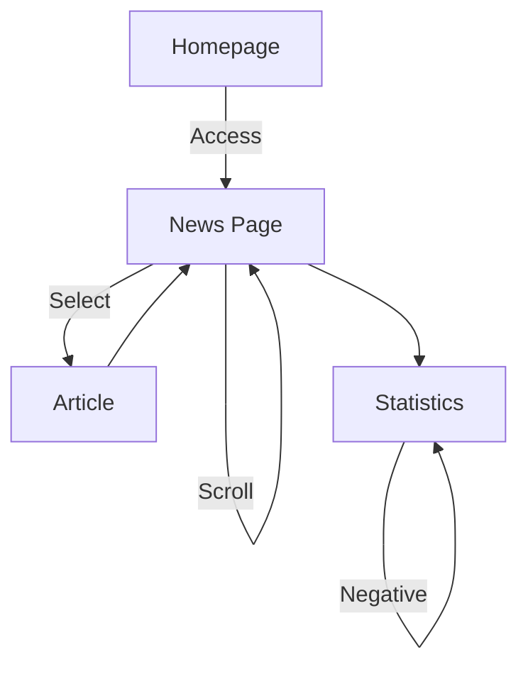

# `Story-Space` for QRMeat
QRMeat is an app with the goal of informing users about the details of the meat products they consume, such as their origin and history. Thus, the primary aim of the app is reflected in its functionality, as the majority of interactions guide users towards the Products details page, as seen bellow.

## Story 1

## Story 2

